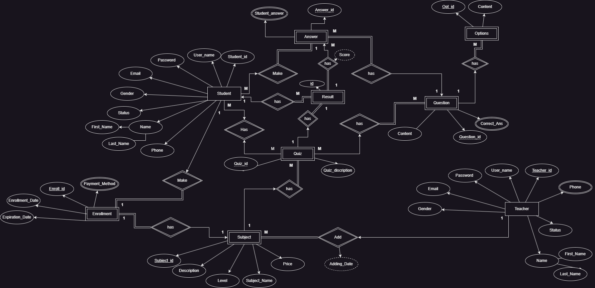
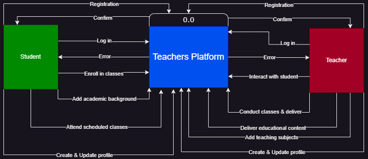

# Educational Platform API

Welcome to the Educational Platform API! This project facilitates an online educational platform where teachers can manage their subjects and schedules, and students can book classes and access learning resources.

# API Endpoints Documentation

This API documentation is generated from a Postman collection.

## Authentication

### Login
**POST** `http://edu1.runasp.net/api/account/login`
```json
{
  "username": "yasser",
  "password": "123qwe.A"
}
```

### Teacher Register
**POST** `http://edu1.runasp.net/api/teacheraccount/register`
Form Data:
- `firstName`, `lastName`, `userName`, `email`, `phone`, `Governorate`, `address`, `password`

### Student Register
**POST** `http://edu1.runasp.net/api/studentaccount/register`
Form Data:
- `firstName`, `lastName`, `email`, `password`, `userName`, `phone`, `level`

### Admin Register
**POST** `http://edu1.runasp.net/api/admin/register`
Header:
- `Authorization: Bearer <token>`
Body:
```json
{
  "username": "sameh",
  "email": "sameh@gmail.com",
  "phone": "+201209598227",
  "password": "123qwe.A",
  "confirmPassword": "123qwe.A"
}
```

---

## Teacher Endpoints
- **GET** All Teachers: `http://edu1.runasp.net/api/teacher`
- **GET** Teachers by Subject: `http://edu1.runasp.net/api/subject/{id}/teacher`
- **GET** Teacher by ID: `http://edu1.runasp.net/api/teacher/{id}`
- **PUT** Update Teacher: `http://edu1.runasp.net/api/teacher/{id}`
- **DELETE** Delete Teacher: `http://edu1.runasp.net/api/teacher/{id}`

## Student Endpoints
- **GET** All Students: `http://edu1.runasp.net/api/student`
- **GET** Student by ID: `http://edu1.runasp.net/api/student/{id}`
- **PUT** Update Student: `http://edu1.runasp.net/api/student/{id}`
- **DELETE** Delete Student: `http://edu1.runasp.net/api/student/{id}`

## Subject Endpoints
- **POST** Add Subject: `http://edu1.runasp.net/api/subject`
- **GET** All Subjects: `http://edu1.runasp.net/api/subject`
- **GET** Subject by ID: `http://edu1.runasp.net/api/subject/{id}`
- **GET** Subjects by Teacher: `http://edu1.runasp.net/api/subject/{id}/subjects`
- **GET** Subjects for a Student: `http://edu1.runasp.net/api/subject/subjects/{id}`
- **PUT** Update Subject: `http://edu1.runasp.net/api/subject/{id}`
- **DELETE** Delete Subject: `http://edu1.runasp.net/api/subject/{id}`

## Quiz Endpoints
- **POST** Add Quiz: `http://edu1.runasp.net/api/quiz`
- **GET** All Quizzes: `http://edu1.runasp.net/api/quiz`
- **GET** Quizzes by Subject: `http://edu1.runasp.net/api/subject/{id}/quizzes`
- **GET** Quiz by ID: `http://edu1.runasp.net/api/quiz/{id}`
- **PUT** Update Quiz: `http://edu1.runasp.net/api/quiz/{id}`
- **DELETE** Delete Quiz: `http://edu1.runasp.net/api/quiz/{id}`

## Question Endpoints
- **POST** Add Question: `http://edu1.runasp.net/api/questions`
- **GET** All Questions: `http://edu1.runasp.net/api/questions`
- **GET** Questions by Quiz: `http://edu1.runasp.net/api/questions/byquiz/{id}`
- **GET** Question by ID: `http://edu1.runasp.net/api/questions/{id}`
- **PUT** Update Question: `http://edu1.runasp.net/api/questions/{id}`
- **DELETE** Delete Question: `http://edu1.runasp.net/api/questions/{id}`

## Enrollment Endpoints
- **POST** Make Enrollment: `http://edu1.runasp.net/api/enrollment?StudentId={id}&SubjectId={id}`
- **GET** Enrollment: `http://edu1.runasp.net/api/enrollment?subjectId={id}&studentId={id}`
- **GET** All Enrollments for a Student: `http://edu1.runasp.net/api/enrollment/student/{id}`
- **GET** All Students in a Subject: `http://edu1.runasp.net/api/enrollment/subject/{id}`
- **DELETE** Delete Enrollment: `http://edu1.runasp.net/api/enrollment`

## Chapter Endpoints
- **POST** Add Chapter: `http://edu1.runasp.net/api/chapters`
- **GET** All Chapters: `http://edu1.runasp.net/api/chapters`
- **GET** Chapters by Subject: `http://edu1.runasp.net/api/chapters/bysubject/{id}`
- **GET** Chapter by ID: `http://edu1.runasp.net/api/chapters/{id}`
- **PUT** Update Chapter: `http://edu1.runasp.net/api/chapters/{id}`
- **DELETE** Delete Chapter: `http://edu1.runasp.net/api/chapters/{id}`

## Chapter File Endpoints
- **POST** Upload File: `http://edu1.runasp.net/api/chapters/{id}/upload`
- **GET** All Files: `http://edu1.runasp.net/api/chapterfiles`
- **GET** Files by Chapter: `http://edu1.runasp.net/api/chapters/{id}/files`
- **GET** File by ID: `http://edu1.runasp.net/api/chapterfiles/{id}`
- **PUT** Update File: `http://edu1.runasp.net/api/chapterfiles/{id}`
- **DELETE** Delete File: `http://edu1.runasp.net/api/chapterfiles/{id}`

This README provides all available API endpoints with methods, URLs, headers, and data requirements.

## Entity-Relationship Diagram (ERD)

## Context Diagram


Thanks for reading!
