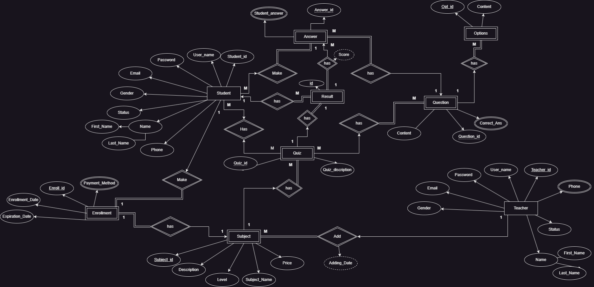

# Educational Platform API

Welcome to the Educational Platform API! This project facilitates an online educational platform where teachers can manage their subjects and schedules, and students can book classes and access learning resources.

## Features

### Teacher Features

- **Add a Subject**: Teachers can create and manage different subjects.
- **Add a Class**: Teachers can schedule classes for their subjects.
- **Add a Quiz for each Subject**: Teachers can create quizzes for their subjects to evaluate student performance.

### Student Features

- **Search for Teacher**: Students can search for teachers based on various criteria.
- **Book a Class**: Students can book classes with teachers.

## Entity-Relationship Diagram (ERD)

## Context Diagram

Thanks for reading!
